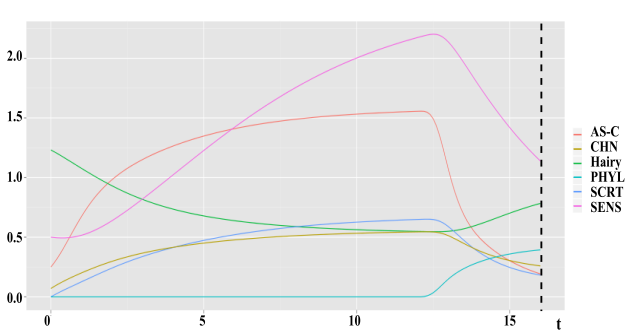

---
output:
  pdf_document: 
    pandoc_args: --highlight=breezedark
---

```{r setup, include=FALSE}
knitr::opts_chunk$set(echo = F)
library(deSolve)
library(randomcoloR)
library(pander)
```

# Comparing Two Different Models.

## The comparison of two different models of the Central Regulatory Circuit of Drosophila.

\vspace*{\fill}
\begin{flushright}
John Busker, Sven Schoonen\\
352905, 407226\\
BFV2\\
13-6-2022\\
Themaopdracht 8
\end{flushright}

\newpage

# Abstract

Mechanoreceptors, are located in a well-organized and controlled way on the *Drosophila melanogaster* head and body, whose genetic support is described in terms of gene networks. Structure of position of 26 macrochaete on the surface of fly head and body, the so-called bristle pattern. [1]

In this work, we established and observed two different models of Central Regulatory Circuit of Drosophila (CRC) from different articles and compared them. The models describe the Central Regulatory Circuit which acts in the early stage of the *Drosophila melanogaster* mechanoreceptors morphogenesis. The main component of the Central Regulatory Circuit is the complex of *Achaete-Scute* genes.

\newpage

# Abbreviations

**CRC** :  Central Regulatory Circuit

\newpage

# Table of Contents

[Abstract](#abstract) \hfill 2

[Abbreviations](#abbreviations) \hfill 3

[Table of Contents](#table-of-contents) \hfill 4  

- 1. [Introduction](#introduction) \hfill 5
- 2. [Methods](#methods) \hfill 7
- 3. [Result](#result) \hfill 8
  - [Models](#models) \hfill 8
- 4. [Discussion](#discussion) \hfill 10
- 5. [Conclusion](#conclusion) \hfill 10
  
[References](#references) \hfill 11

[Appendix Code](#appendix-code) \hfill 12  
[Appendi Graph](#appendix-graph) \hfill 12

\newpage

# Introduction

The large bristles function as mechanoreceptors appear for elements of the peripheral nervous system in the drosophila body. These mechanoreceptors are important in the daily life of a fly, including walking, flying, etc. Type I and type II mechanoreceptors together allow the flies (adults and larvae) to receive various types of mechanical information from their environments [6].

This bristles structure is practically unchanged in all the species representatives and is a taxonomic character. A mechanoreceptor is made up out of four cells: shaft (trichogen), socket (tormogen), neuron, and glial cell (thecogen). The parent of all these components is the single parental cell (SOP cell—Sensory Organ Precursor cell) [2].

The morphogenesis of macrochaete involves three stages. In the first stage, the proneural clusters segregate from the ectodermal cells of the wing imaginal disc. At the second stage, the SOP cell is determined and the position is specified. In the third stage, the SOP cell go through two asymmetric divisions , and the daughter cells convert into the components of mechanoreceptor [5].

Small bristles are large in numbers, and have no strictly determined localization, being organized in more or less regular rows. The number and location of large bristles are stringently determined. These represent a species specific characteristic. The bristle pattern characteristic of each species had been evolutionarily established by losing part of macrochaetes from the common ancestral set [5].

Two different models have been searched for. Both models deal with the CRC circuit, but they use different models. From both models, 6 proteins were extracted. Since these are the most important or have the most influence. These 6 proteins are: Acaete-Scute (AS-C), Hairy, Senseless (SENS), Scratch (SCRT), Charlatan (CHN), Phyllopod (PHYL). These are shown in the graphs.

Daughterless (DA), Extramacrochaete (EMC), Groucho (GRO), Seven in one (SINA) and Ubiquitin (UB) are also important proteins, but the content of these is almost unchanged, shown by study [3-4].

Morphogenesis of drosophila mechanoreceptor is a perfect example of a gene network supporting acyclic processes. Which ensures reaching a steady finite state.

Formalized description, systematization, and analysis of gene networks with the help of mathematical and numerical modeling allows to understand mechanisms of functioning of these systems and to predict their behavior in different conditions. On the other hand, this mathematical approach gives possibility to construct artificial analogues of these natural systems in order to use them in various applications.

The main aim of our work is elaboration of mathematical tools which allow giving full description of the CRC circuit. With the help of 2 different articles with different models.

\newpage

# Methods

Since we have 2 models, we also have 2 equations.

This is the differential equation of the first article [3]:

$$\large\frac{dx}{dt} = k_{x}\frac{\sigma_{1}(Dx) + \sigma_{3}(z) + \sigma_{5}(w)}{(1 + Gy)(1 + Ex)} - (1 + p(t-\Delta{t})US)m_{x}x$$  
$$\large\frac{dy}{dt} = k_{y}\frac{C}{d1 + u^{m_{r}}}$$  
$$\large\frac{dz}{dt} = k_{z}s_{3}(Dx) - m_{s}z$$  
$$\large\frac{du}{dt} = k_{u}s_{4}(Dx) - m_{u}u$$  
$$\large\frac{dw}{dt} = k_{w}s_{5}(Dx) - m_{w}w$$  
$$\large\frac{dp}{dt} = k_{p}\frac{s_{6}(Dx)h(t-\Delta{t})(t-\Delta{t}^2)}{L + h(t-\Delta{t})(t-\Delta{t})^2}$$ 

This is the other model that has been created by the second article [4]. This is the differential equation used by the article:

$$\large\frac{dx}{dt} = \frac{\sigma_{1}(Dx) + \sigma_{3}(z) + \sigma_{5}(w)}{(1 + Gy)(1 + Ex)} - k_{x}(1 + p(t-\Delta{t})US)x$$  
$$\large\frac{dy}{dt} = \frac{C}{d1 + u}-k_{y}y$$  
$$\large\frac{dz}{dt} = s_{3}(Dx) - k_{z}z$$  
$$\large\frac{du}{dt} = s_{4}(Dx) - k_{u}u$$  
$$\large\frac{dw}{dt} = s_{5}(Dx) - k_{w}w$$  
$$\large\frac{dp}{dt} = \frac{s_{6}(Dx)h(t-\Delta{t})(t-\Delta{t}^2)}{1 + (t-\Delta{t})^2} -  k_{p}p$$

The positive coefficients m~x~, m~y~, m~z~, m~u~, m~w~ and m~p~  characterize the degradation rate of their corresponding proteins. Parameters D, E, G, S, and U of (1) are time-independent, since the content of DA, EMC, GRO, SINA, and Ub proteins is almost unchanged in the process [4].

In the last equation we use a Heaviside function, *h(t)*, that express the decomposition of the process with some delay of *t* = 12.

The sigma function $\sigma$ functions *l* = 1,3,5 and $s_i > 0, i = 3,4,5,6$ are positive and describe the positive  feedback.

Here are all the params and state values.

```{r}
pander(data.frame("dt_x"= 0,"dt_y"= 0,"dt_z"= 0,"dt_u"= 0,"dt_w"= 0,"dt_p"= 0,"u0"= 0,"w0"= 0,"p0"= 0,"Gro"= 1,"EMC"= 1,"C"= 1,"m1"= 1,"m2"= 1,"m3"= 1,"m4"= 1,"m5"= 1,"m6"= 1,"m7"= 1,"L"= 1,"kx"= 1,"ky"= 1,"kz"= 1,"ku"= 1,"kw"= 1,"kp"= 1,"Gro"= 1,"D"= 2.05,"UB"= 1.17,"SINA"= 5.6,"n1"= 2,"n3"= 2,"n5"= 2,"n1"= 2,"a3"=  3.61,"b3"= 4.96,"c3"= 1.35,"a4"= 4.43,"b4"= 6.09,"c4"= 1.66,"a5"= 8.09,"b5"= 11.13,"c5"= 3.03,"a6"= 2.67,"b6"= 3.67,"c6"= 1.00,"d1"= 7.46,"d3"= 2.77,"d5"= 1.24,"y0"= 3,"x0"= 3 / 20,"z0"= 3 / 20),
       split.table = 80, style = 'rmarkdown')
```


\newpage

# Result

The result of this research papers are two graphs showing the models and the difference.

## Models

```{r}
# A function to plot the data
plotModel <- function(df){
plot(df$time, df$ASC, type='l',ylim=c(0, 4), col=cols[1], lwd=2, xlab="time", ylab="concentration")
lines(df$time, df$Hairy, col=cols[2], lwd=2)
lines(df$time, df$Senseless, col=cols[3], lwd=2)
lines(df$time, df$Scratch, col=cols[4], lwd=2)
lines(df$time, df$Charlatan, col=cols[5], lwd=2)
lines(df$time, df$Phyllopod, col=cols[6], lwd=2)
legend("topright",ncol=3, c("AS-C","Hairy","Senseless", "Scratch", "Charlatan", "Phyllopod"), fill=c(cols[1],cols[2],cols[3], cols[4], cols[5], cols[6]))
}
```

```{r}
'%=%' <- function(x, y) {
  x <- as.character(substitute(x)[-1])
  if (length(y) < length(x))
    y <- rep(y, ceiling(length(x) / length(y)))
  if (length(y) > length(x))
    y <- y[1:length(x)]
  mapply(assign, x, y, MoreArgs = list(envir = parent.frame()))
  invisible()
}
h <- function(i) i > 0
sigma1 <- function (v) {
  h(v) * d1 * v ^ n1 / (1 + v ^ n1)
}
sigma3 <- function (v) {
  h(v) * d3 * v ^ n3 / (1 + v ^ n3)
}
sigma5 <- function (v) {
  h(v) * d5 * v ^ n5 / (1 + v ^ n5)
}
s3 <- function (v) {
  h(v) * a3 * exp((v - b3) / c3) / (1 + exp((v - b3) / c3))
}
s4 <- function (v) {
  h(v) * a4 * exp((v - b4) / c4) / (1 + exp((v - b4) / c4))
}
s5 <- function (v) {
  h(v) * a5 * exp((v - b5) / c5) / (1 + exp((v - b5) / c5))
}
s6 <- function (v) {
  h(v) * a6 * exp((v - b6) / c6) / (1 + exp((v - b6) / c6))
}
dt_x = 0
dt_y = 0
dt_z = 0
dt_u = 0
dt_w = 0
dt_p = 0
Gro = 1
EMC = 1
D = 2.05
UB = 1.17
SINA = 5.6
C = 1
n1 = 2
n3 = 2
n5 = 2
m1 = 1
m2 = 1
m3 = 1
m4 = 1
m5 = 1
m6 = 1
m7 = 1
L = 1
kx = 1
ky =1
kz = 1
ku = 1
kw = 1
kp = 1
a3 =  3.61
b3 = 4.96
c3 = 1.35
a4 = 4.43
b4 = 6.09
c4 = 1.66
a5 = 8.09
b5 = 11.13
c5 = 3.03
a6 = 2.67
b6 = 3.67
c6 = 1.00
d1 = 7.46
d3 = 2.77
d5 = 1.24
y0 = 3
x0 = 3 / 20
z0 = 3 / 20
u0 = 0
w0 = 0
p0 = 0
```


```{r}
x_model <- function(t, dt, startValue, point, args, ...) {
  if (t < 0) { startValue }
  else {
    c(x, y, z, u, w, p) %=% point
    c(x_curr, y_curr, z_curr, u_curr, w_curr, p_curr) %=% point
    lagPoint <- kx * (sigma1(D * x) + sigma3(z) + sigma5(w)) / ((1 + Gro * y) * (1 + EMC * x)) - m1 * x * (1 + p_curr * UB * SINA)
  }
}
y_model <- function(t, dt, startValue, point, args, ...) {
  if (t < 0) { startValue }
  else {
    c(x, y, z, u, w, p) %=% point
    c(x_curr, y_curr, z_curr, u_curr, w_curr, p_curr) %=% point
    lagPoint <- ky * C / (1 + u ^ m7) - m2 * y_curr
  }
}
z_model <- function(t, dt, startValue, point, args, ...) {
  if (t < 0) { startValue }
  else {
    c(x, y, z, u, w, p) %=% point
    c(x_curr, y_curr, z_curr, u_curr, w_curr, p_curr) %=% point
    lagPoint <- kz * s3(D * x) - m3 * z_curr
  }
}
u_model <- function(t, dt, startValue, point, args, ...) {
  if (t < 0) { startValue }
  else {
    c(x, y, z, u, w, p) %=% point
    c(x_curr, y_curr, z_curr, u_curr, w_curr, p_curr) %=% point
    lagPoint <- ku * s4(D * x) - m4 * u_curr
  }
}
w_model <- function(t, dt, startValue, point, args, ...) {
  if (t < 0) { startValue }
  else {
    c(x, y, z, u, w, p) %=% point
    c(x_curr, y_curr, z_curr, u_curr, w_curr, p_curr) %=% point
    lagPoint <- kw * s5(D * x) - m5 * w_curr
  }
}
p_model <- function(t, dt, startValue, point, args, ...) {
  if (t < 0) { startValue }
  else {
    c(x, y, z, u, w, p) %=% point
    c(x_curr, y_curr, z_curr, u_curr, w_curr, p_curr) %=% point
    lagPoint <- (s6(D * x) * h(t - 12) * (t - 12) ^ 2) / (1 + (t - 12) ^ 2) - kp * p_curr
  }
}
CRC.model <- function(t, p, parms, ...) {
       list(c(x_model(t, dt_x, x0, p), y_model(t, dt_y, y0, p), z_model(t, dt_z, z0, p), u_model(t, dt_u, u0, p), w_model(t, dt_w, w0, p), p_model(t, dt_p, p0, p)))
}
```


```{r, fig.cap="The CRC model of the first article"}
t <- seq(0, 16, by = 0.1)
start <- c(x0 * kx, y0 * ky, z0 * kz, u0 * ku, w0 * kw, p0 * kp)
traj <- data.frame(dede(start, t, func = CRC.model, parms = parameters))
cols <- distinctColorPalette(6)
plot.new()
rect(par("usr")[1], par("usr")[3],
     par("usr")[2], par("usr")[4],
     col = "#fdfbf3")
par(new = TRUE)
names(traj) <- c("time", "ASC", "Hairy", "Senseless", "Scratch", "Charlatan", "Phyllopod")
plotModel(traj)
```

The *AS-C* curve increases immediately and reached a steady state, after a while it decreases to about a concentration of below 1. The curve of *Hairy* goes steadily down until *AS-C* decreases. Then the concentration went up.

The other curves *Senseless*, *Scratch* and *Charlatan* all followed the same curve just with a lower value, and it steady went down at the same time point as *AS-C*.

*Phyllopod* stays the whole time around 0, until all the others one decreases/increases.

```{r}
x_model <- function(t, dt, startValue, point, args, ...) {
  if (t < 0) { startValue }
  else {
    c(x, y, z, u, w, p) %=% point
    c(x_curr, y_curr, z_curr, u_curr, w_curr, p_curr) %=% point
    lagPoint <- (sigma1(D * x) + sigma3(z) + sigma5(w)) / ((1 + Gro * y) * (1 + EMC * x)) - kx * (1 + p_curr * UB * SINA) * x
  }
}
y_model <- function(t, dt, startValue, point, args, ...) {
  if (t < 0) { startValue }
  else {
    c(x, y, z, u, w, p) %=% point
    c(x_curr, y_curr, z_curr, u_curr, w_curr, p_curr) %=% point
    lagPoint <- (C / (d1 + u_curr)) - ky * y_curr
  }
}
z_model <- function(t, dt, startValue, point, args, ...) {
  if (t < 0) { startValue }
  else {
    c(x, y, z, u, w, p) %=% point
    c(x_curr, y_curr, z_curr, u_curr, w_curr, p_curr) %=% point
    lagPoint <- s3(D * x) - kz * z_curr
  }
}
u_model <- function(t, dt, startValue, point, args, ...) {
  if (t < 0) { startValue }
  else {
    c(x, y, z, u, w, p) %=% point
    c(x_curr, y_curr, z_curr, u_curr, w_curr, p_curr) %=% point
    lagPoint <- s4(D * x) - ku * u_curr
  }
}
w_model <- function(t, dt, startValue, point, args, ...) {
  if (t < 0) { startValue }
  else {
    c(x, y, z, u, w, p) %=% point
    c(x_curr, y_curr, z_curr, u_curr, w_curr, p_curr) %=% point
    lagPoint <- s5(D * x) - kw * w_curr
  }
}
p_model <- function(t, dt, startValue, point, args, ...) {
  if (t < 0) { startValue }
  else {
    c(x, y, z, u, w, p) %=% point
    c(x_curr, y_curr, z_curr, u_curr, w_curr, p_curr) %=% point
    lagPoint <- (s6(D * x) * h(t - 12) * (t - 12) ^ 2) / (1 + (t - 12) ^ 2) - kp * p_curr
  }
}
```

\newpage

```{r, fig.cap="The CRC model of the second article"}
traj.2 <- data.frame(dede(start, t, func = CRC.model, parms = parameters))
plot.new()
rect(par("usr")[1], par("usr")[3],
     par("usr")[2], par("usr")[4],
     col = "#fdfbf3")
par(new = TRUE)
names(traj.2) <- c("time", "ASC", "Hairy", "Senseless", "Scratch", "Charlatan", "Phyllopod")
plotModel(traj.2)
```

The curve of *Hairy* goes steadily down until it reached a steady state. *AS-C* curve reaches a steady state pretty quick, after a while it nose dives to about a concentration of 1.

At the same time, other curves *Senseless*, *Scratch* and *Charlatan* all followed the same curve just with a lower value, and it steady went down at the same time point as *AS-C*.

*Phyllopod* stays the whole time around 0, until all the others one, except *hairy*, reduce.

\newpage

# Discussion

We have encountered problems in this paper. There is no concrete experimental data. There is a site, FlyAtlas, but you cannot actually use it.  Firstly, there is nothing about *AS-C*. And secondly, it is not clear which data we should use.

Analysis of gene networks with the help of mathematical and numerical modeling allows to understand mechanisms of functioning of these systems and to predict their behavior in different conditions.

In the second article, they give other parameter values, but if you go to the site mentioned in the article. You get a graph with the same values as the first article, so we used these values. And we have not played with the parameters values to see what happens. But the first article did changed the values and their outcome was this: 'From the biological point of view, this means a ban on the formation of a mechanoreceptor' [3].

As expected, all the values of the first graph are lower than the second one. Alot of the values of the first one are 0. 

We now have two graphs, but we still do not really know which model uses the best differential equation.

# Conclusion

The conclusion we drew is that we compared the different models. But we lack the experimental data to see which is good. We now have two graphs with two different CRC models, but as mentioned earlier, there is simply no/little experimental data. When more data emerges, we can really compare which model is the best. Or how we can then adjust it so that the model becomes even better.

\newpage

# References

[1] = Dagmara P. Furman, Tatyana A. Bukharina, (2019) 'The gene network determining development of Drosophila melanogaster mechanoreceptors' *sciencedirect* https://www.sciencedirect.com/science/article/abs/pii/S1476927109000292?via%3Dihub **24-05-22**  
[2] = Vladimir P. Golubyatnikov, Tatyana A. Bukharina, Dagmara P. Furman, (2015) 'A model study of the morphogenesis of D. melanogaster mechanoreceptors: The central regulatory circuit' *worldscientific* https://www.worldscientific.com/doi/abs/10.1142/S0219720015400065 **24-05-22**  
[3] = Bukharina, T.A., Akinshin, A.A., Golubyatnikov, V.P., (2020) 'Mathematical and Numerical Models of the Central Regulatory Circuit of the Morphogenesis System of Drosophila' *Springer* https://link.springer.com/article/10.1134/S1990478920020040 **24-05-22**  
[4] = Ayupova, N.B., Demidenko, G.V., Matveeva, I.I., Fadeev, S.I, Zhubr , A.V. (2018) 'MATHEMATICAL AND NUMERICAL MODELS
OF TWO ASYMMETRIC GENE NETWORKS' *nsc* http://semr.math.nsc.ru/v15/p1271-1283.pdf **24-05-22**  
[5] = D.P Furman, T.A Bukharina, (2008 ) 'How Drosophila melanogaster Forms its Mechanoreceptors' *NCBI* https://www.ncbi.nlm.nih.gov/pmc/artices/PMC2685642/ **15-6-22**  
[6] = Xin Liang, Landi Sun, Zhen Liu, (2017) 'Mechanoreceptors in Drosophila melanogaster' https://link.springer.com/chapter/10.1007/978-981-10-6526-2_3 **15-6-22**

\newpage

# Appendix Graph




\newpage

# Appendix Code

```{r, eval=F, echo=T}
# A function to plot the data
plotModel <- function(df){
plot(df$time, df$ASC, type='l',ylim=c(0, 4), col=cols[1], lwd=2, xlab="time", 
     ylab="concentration")
lines(df$time, df$Hairy, col=cols[2], lwd=2)
lines(df$time, df$Senseless, col=cols[3], lwd=2)
lines(df$time, df$Scratch, col=cols[4], lwd=2)
lines(df$time, df$Charlatan, col=cols[5], lwd=2)
lines(df$time, df$Phyllopod, col=cols[6], lwd=2)
legend("topright",ncol=3, c("AS-C","Hairy","Senseless", "Scratch", "Charlatan", 
                            "Phyllopod"), fill=c(cols[1],cols[2],cols[3], 
                                                 cols[4], cols[5], cols[6]))
}
'%=%' <- function(x, y) {
  x <- as.character(substitute(x)[-1])
  if (length(y) < length(x))
    y <- rep(y, ceiling(length(x) / length(y)))
  if (length(y) > length(x))
    y <- y[1:length(x)]
  mapply(assign, x, y, MoreArgs = list(envir = parent.frame()))
  invisible()
}
# The Heaviside function
h <- function(i) i > 0
# The sigman functions
sigma1 <- function (v) {
  h(v) * d1 * v ^ n1 / (1 + v ^ n1)
}
sigma3 <- function (v) {
  h(v) * d3 * v ^ n3 / (1 + v ^ n3)
}
sigma5 <- function (v) {
  h(v) * d5 * v ^ n5 / (1 + v ^ n5)
}
s3 <- function (v) {
  h(v) * a3 * exp((v - b3) / c3) / (1 + exp((v - b3) / c3))
}
s4 <- function (v) {
  h(v) * a4 * exp((v - b4) / c4) / (1 + exp((v - b4) / c4))
}
s5 <- function (v) {
  h(v) * a5 * exp((v - b5) / c5) / (1 + exp((v - b5) / c5))
}
s6 <- function (v) {
  h(v) * a6 * exp((v - b6) / c6) / (1 + exp((v - b6) / c6))
}
# All the params
dt_x = 0
dt_y = 0
dt_z = 0
dt_u = 0
dt_w = 0
dt_p = 0
Gro = 1
EMC = 1
D = 2.05
UB = 1.17
SINA = 5.6
C = 1
n1 = 2
n3 = 2
n5 = 2
m1 = 1
m2 = 1
m3 = 1
m4 = 1
m5 = 1
m6 = 1
m7 = 1
L = 1
kx = 1
ky =1
kz = 1
ku = 1
kw = 1
kp = 1
a3 =  3.61
b3 = 4.96
c3 = 1.35
a4 = 4.43
b4 = 6.09
c4 = 1.66
a5 = 8.09
b5 = 11.13
c5 = 3.03
a6 = 2.67
b6 = 3.67
c6 = 1.00
d1 = 7.46
d3 = 2.77
d5 = 1.24
y0 = 3
x0 = 3 / 20
z0 = 3 / 20
u0 = 0
w0 = 0
p0 = 0
# The model of the first article
x_model <- function(t, dt, startValue, point, args, ...) {
  if (t < 0) { startValue }
  else {
    c(x, y, z, u, w, p) %=% point
    c(x_curr, y_curr, z_curr, u_curr, w_curr, p_curr) %=% point
    lagPoint <- kx * (sigma1(D * x) + sigma3(z) + sigma5(w)) / ((1 + Gro * y) 
                                    * (1 + EMC * x)) - m1 * x 
                                    * (1 + p_curr * UB * SINA)
  }
}
y_model <- function(t, dt, startValue, point, args, ...) {
  if (t < 0) { startValue }
  else {
    c(x, y, z, u, w, p) %=% point
    c(x_curr, y_curr, z_curr, u_curr, w_curr, p_curr) %=% point
    lagPoint <- ky * C / (1 + u ^ m7) - m2 * y_curr
  }
}
z_model <- function(t, dt, startValue, point, args, ...) {
  if (t < 0) { startValue }
  else {
    c(x, y, z, u, w, p) %=% point
    c(x_curr, y_curr, z_curr, u_curr, w_curr, p_curr) %=% point
    lagPoint <- kz * s3(D * x) - m3 * z_curr
  }
}
u_model <- function(t, dt, startValue, point, args, ...) {
  if (t < 0) { startValue }
  else {
    c(x, y, z, u, w, p) %=% point
    c(x_curr, y_curr, z_curr, u_curr, w_curr, p_curr) %=% point
    lagPoint <- ku * s4(D * x) - m4 * u_curr
  }
}
w_model <- function(t, dt, startValue, point, args, ...) {
  if (t < 0) { startValue }
  else {
    c(x, y, z, u, w, p) %=% point
    c(x_curr, y_curr, z_curr, u_curr, w_curr, p_curr) %=% point
    lagPoint <- kw * s5(D * x) - m5 * w_curr
  }
}
p_model <- function(t, dt, startValue, point, args, ...) {
  if (t < 0) { startValue }
  else {
    c(x, y, z, u, w, p) %=% point
    c(x_curr, y_curr, z_curr, u_curr, w_curr, p_curr) %=% point
    lagPoint <- (s6(D * x) * h(t - 12) * (t - 12) ^ 2) / 
                (1 + (t - 12) ^ 2) - kp * p_curr
  }
}
CRC.model <- function(t, p, parms, ...) {
       list(c(x_model(t, dt_x, x0, p), y_model(t, dt_y, y0, p), 
              z_model(t, dt_z, z0, p), u_model(t, dt_u, u0, p),
              w_model(t, dt_w, w0, p), p_model(t, dt_p, p0, p)))
}
# Run the simulation
t <- seq(0, 16, by = 0.1)
start <- c(x0 * kx, y0 * ky, z0 * kz, u0 * ku, w0 * kw, p0 * kp)
traj <- data.frame(dede(start, t, func = CRC.model, parms = parameters))
cols <- distinctColorPalette(6)
plot.new()
rect(par("usr")[1], par("usr")[3],
     par("usr")[2], par("usr")[4],
     col = "#fdfbf3")
par(new = TRUE)
names(traj) <- c("time", "ASC", "Hairy", "Senseless", 
                 "Scratch", "Charlatan", "Phyllopod")
plotModel(traj)
# The model of the second function
x_model <- function(t, dt, startValue, point, args, ...) {
  if (t < 0) { startValue }
  else {
    c(x, y, z, u, w, p) %=% point
    c(x_curr, y_curr, z_curr, u_curr, w_curr, p_curr) %=% point
    lagPoint <- (sigma1(D * x) + sigma3(z) + sigma5(w)) / 
      ((1 + Gro * y) * (1 + EMC * x)) - kx * (1 + p_curr * UB * SINA) * x
  }
}
y_model <- function(t, dt, startValue, point, args, ...) {
  if (t < 0) { startValue }
  else {
    c(x, y, z, u, w, p) %=% point
    c(x_curr, y_curr, z_curr, u_curr, w_curr, p_curr) %=% point
    lagPoint <- (C / (d1 + u_curr)) - ky * y_curr
  }
}
z_model <- function(t, dt, startValue, point, args, ...) {
  if (t < 0) { startValue }
  else {
    c(x, y, z, u, w, p) %=% point
    c(x_curr, y_curr, z_curr, u_curr, w_curr, p_curr) %=% point
    lagPoint <- s3(D * x) - kz * z_curr
  }
}
u_model <- function(t, dt, startValue, point, args, ...) {
  if (t < 0) { startValue }
  else {
    c(x, y, z, u, w, p) %=% point
    c(x_curr, y_curr, z_curr, u_curr, w_curr, p_curr) %=% point
    lagPoint <- s4(D * x) - ku * u_curr
  }
}
w_model <- function(t, dt, startValue, point, args, ...) {
  if (t < 0) { startValue }
  else {
    c(x, y, z, u, w, p) %=% point
    c(x_curr, y_curr, z_curr, u_curr, w_curr, p_curr) %=% point
    lagPoint <- s5(D * x) - kw * w_curr
  }
}
p_model <- function(t, dt, startValue, point, args, ...) {
  if (t < 0) { startValue }
  else {
    c(x, y, z, u, w, p) %=% point
    c(x_curr, y_curr, z_curr, u_curr, w_curr, p_curr) %=% point
    lagPoint <- (s6(D * x) * h(t - 12) * (t - 12) ^ 2) / 
      (1 + (t - 12) ^ 2) - kp * p_curr
  }
}
# Run it for the second article
traj.2 <- data.frame(dede(start, t, func = CRC.model, parms = parameters))
plot.new()
rect(par("usr")[1], par("usr")[3],
     par("usr")[2], par("usr")[4],
     col = "#fdfbf3")
par(new = TRUE)
names(traj.2) <- c("time", "ASC", "Hairy", "Senseless", 
                   "Scratch", "Charlatan", "Phyllopod")
plotModel(traj.2)
```
